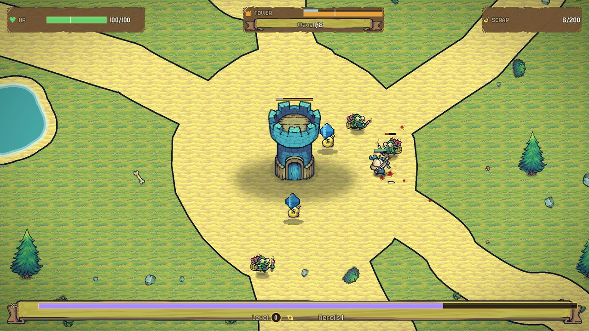
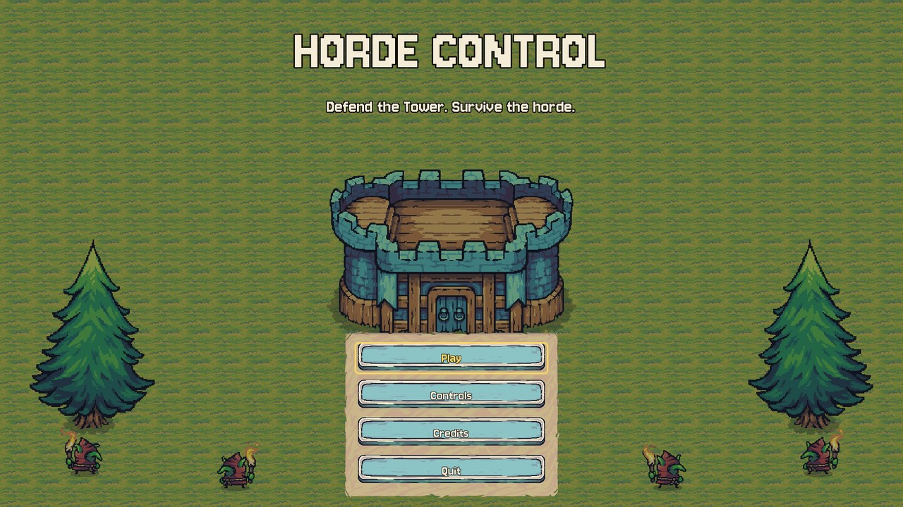
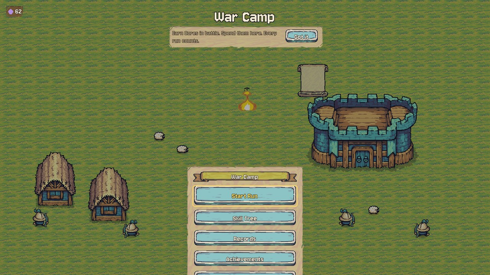
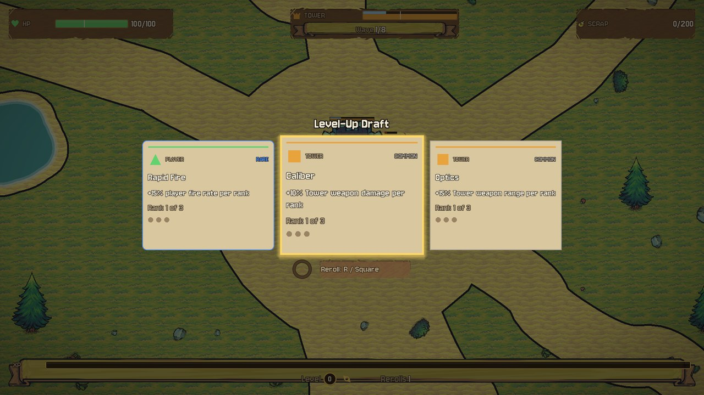
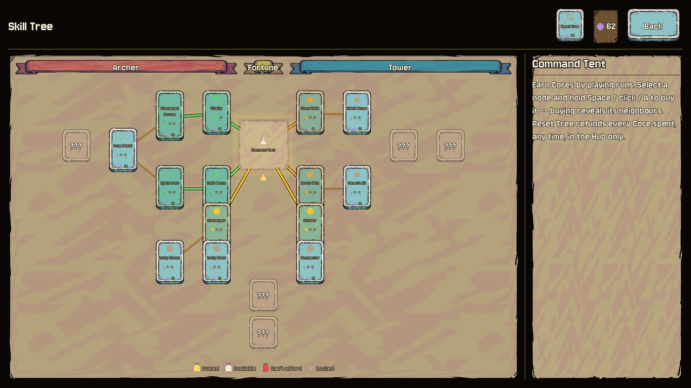
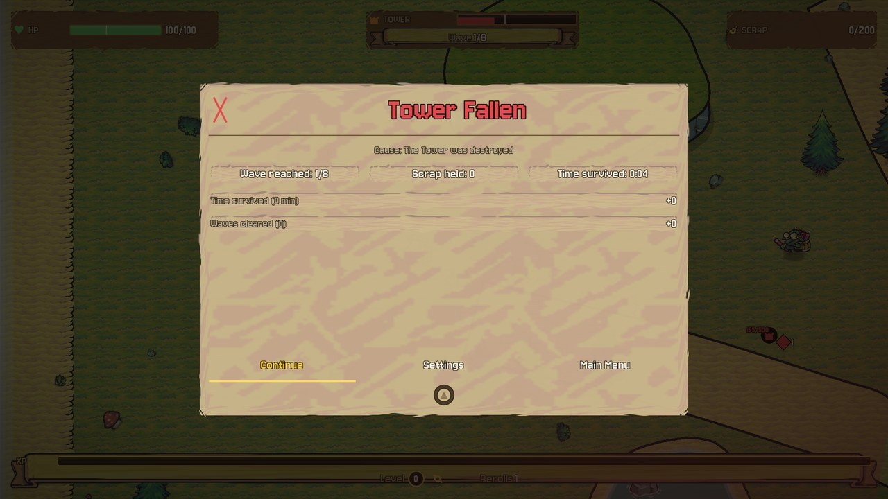

<div align="center">

# Horde Control

**Defend the Tower. Survive the horde.**

A top-down survival roguelite in pixel art. You and a stone Tower stand in the middle of an
island while goblin waves come at both of you. Keep yourself alive, keep the Tower standing,
and spend what each run earns on a permanent skill tree before the next one.

**Windows: download the exe from [Releases](https://github.com/Sayandeep1013/Horde-Control/releases).**



</div>

---

## Screenshots

| Title | War Camp | Level-Up Draft |
|---|---|---|
|  |  |  |

| Skill Tree | Results |
|---|---|
|  |  |

## How it plays

- **Two things to keep alive.** You and the Tower each have health. If either falls, the run ends.
  Some goblins go for the Tower, some hunt you, some switch targets. You cannot guard both corners at once.
- **Your bow fires on its own.** You move; the archer picks targets. The Tower shoots too.
- **Level up mid-fight.** Kills drop XP crystals. When the bar fills, the game pauses and you pick one of
  three upgrades. It applies at once. Cards come as Common, Rare or Epic, and rarer ones get likelier as you level.
- **Every run counts.** A run pays out **Cores** when it ends, win or lose: for time survived, waves
  cleared, kills, gold carried and victory. Spend them in the **War Camp** on the Skill Tree.
- **The Skill Tree** has three branches (Archer, Tower, Fortune). Buying a node reveals its neighbours.
  Bonuses apply at the start of the next run. Reset refunds everything, free.
- **Achievements** unlock new upgrade cards, such as Piercing Arrows, Multishot and Tower Volley.

Eight waves make a full run. Most first runs end sooner.

## Download (Windows)

1. Get `HordeControl.exe` from the latest [Release](https://github.com/Sayandeep1013/Horde-Control/releases).
2. Run it. No installer.
3. Progress saves to `%APPDATA%\Godot\app_userdata\Horde Control\`.

Windows 10 or 11, 64-bit. Any GPU that runs Vulkan.

## Controls

| Action | Keyboard | Gamepad |
|---|---|---|
| Move | WASD or arrow keys | Left stick |
| Shoot | Automatic | Automatic |
| Choose an upgrade | A / D or ← / → to move, 1 2 3 to pick directly | D-pad |
| Confirm | Hold Space or Enter, or click | Hold A |
| Reroll the upgrades | R | X |
| Pause | Esc | Start |

Settings (volume for music and effects, display mode, V-Sync, screen shake, damage numbers) are on
the title screen, in the War Camp and in the pause menu.

## Building from source

Godot **4.7.1** (standard, not .NET).

```bash
# open the project
godot --path . --editor

# run the tests (gdUnit4, headless)
powershell -File tests/run_tests.ps1 -TestPath "res://tests"

# export the Windows build (export templates 4.7.1 installed)
godot --headless --path . --export-release "Windows Desktop" builds/windows/HordeControl.exe
```

The test suite has about 750 cases. One of them, `tests/harness/fail/test_trivial_fail.gd`,
fails on purpose to prove the runner reports failures.

## How it's built

GDScript, no plugins beyond gdUnit4 for tests.

```
src/core/        SimClock, PauseAuthority, EventBus, EntityRegistry, SimLoop: one ordered tick
src/director/    Wave Director and the Pressure Metric: what spawns, where, and when
src/enemy/       three goblin intents (Tower Seeker, Player Hunter, Opportunist), attack slots, animation
src/player/      controller, auto-aimed bow, overhead bars
src/tower/       health and shield, weapon, evolution stages
src/upgrade/     the Level-Up Draft pool and effects
src/meta/        MetaProgress: save profile, settlement, skill tree, achievements
src/environment/ the island: paths, ponds, plateaus, groves, landmarks
src/ui/          HUD, Draft, War Camp, Skill Tree, menus
```

The design lives in [`MASTER_SDLC.md`](MASTER_SDLC.md) and [`docs/`](docs/): every gameplay number is in
its Provisional Values Register, and every design change has a row in its Review Decision Log.

## Status

| | |
|---|---|
| Playable prototype | Full run loop, meta progression, Windows build |
| Content | One island, three enemy types, eight waves, 18 upgrade cards, 20 skill nodes |
| Next | Elites and a boss, a second biome, balance passes, more cards |

## Credits

- Art: [Tiny Swords](https://pixelfrog-assets.itch.io/tiny-swords) by Pixel Frog (CC0 edition)
- Music: "Battle Theme A" by cynicmusic, [OpenGameArt](https://opengameart.org/content/battle-theme-a) (CC0)
- Sound effects: [Kenney](https://kenney.nl) (CC0)
- Font: Jersey 10 by The Soft Type Project Authors (SIL Open Font License 1.1)
- Engine: [Godot](https://godotengine.org) (MIT)

Where every third-party file came from, with hashes: `assets/third_party/*/PROVENANCE.md`.
